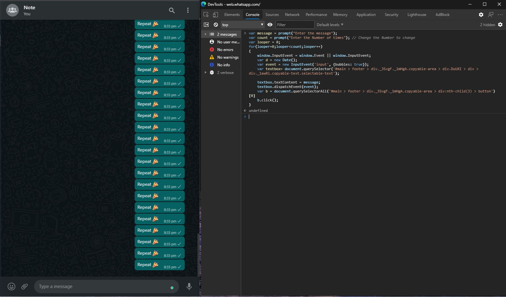

Do your friends constantly spam you just to get your attention, wanna give this pain back? Don't worry. Then this JS script got you covered. 

Let's get over what we are going to do, We are going to use Developer Console to inject some script into WhatsApp Web. 

### Open WhatsApp Web and the chat in which your bot should spam

### Open Developer Console 
Either search for **Developer Tools** in the drop-down menu in any browser or use the shortcut `Ctrl + Shift + I'd move to the **Console tab** where we can write Javascript and interact with the DOM (Document Object Model).

### Let's enter some text in the message box
We are going to use CSS selectors to select a specific section of the web page and then use `document.querySelector()` to get the DOM object of that section. Let's select the input area object and store it in the `textbox` variable
```
var textpath = '#main > footer > div._3SvgF._1mHgA.copyable-area > div.DuUXI > div > div._1awRl.copyable-text.selectable-text';
var textbox = document.querySelector(textpath);
```
Now type something directly in the message box, and enter `textbox.textContent` into the console and it should return the same text, let's try setting some text via the Developer Console instead of directly typing it in
```
textbox.textContent = "Some Text"
```
The same text must be updated in the WhatsApp web GUI. Yaay, we hare halfway done    

but there is a problem, we have the record button where the send button is supposed to be. That's because we have changed the state of the message box internally but the input needs to know that something has been typed on it to update the mic button to the send button. Let's do this by 
```
window.InputEvent = window.Event || window.InputEvent
var event = new InputEvent('input', {bubbles: true});
textbox.dispatchEvent(event);
```
Now the send button is visible 


### Send the message
All that is left is to select the send button and send a click signal to let it know the message is read to be sent. Let's do this by first selecting the send button and then by calling the click method. 

```
var buttonpath = '#main > footer > div._3SvgF._1mHgA.copyable-area > div:nth-child(3) > button';
var b = document.querySelectorAll(buttonpath)[0]
b.click();
```
### 🎉 You have now automated the process of sending one message, lets try to send many continuously 
One easy way is to just run this whole code in a loop. 
```
var i = 0;
for(i=0;i<10;i++){
    var textpath = '#main > footer > div._3SvgF._1mHgA.copyable-area > div.DuUXI > div > div._1awRl.copyable-text.selectable-text';
    var textbox = document.querySelector(textpath);
    textbox.textContent = "Some Text";

    window.InputEvent = window.Event || window.InputEvent;
    var event = new InputEvent('input', {bubbles: true});
    textbox.dispatchEvent(event);
    
    var buttonpath = '#main > footer > div._3SvgF._1mHgA.copyable-area > div:nth-child(3) > button';
    var b = document.querySelectorAll(buttonpath)[0]
    b.click();
}
```
This is all great but let's make this code bit more general by allowing the user to select the text and number of repetitions at runtime. 

```
var message = prompt("Enter the message");
var count = prompt("Enter the Number of times"); // Change the Number to change 
var looper = 0;
for(looper=0;looper<count;looper++)
{
    window.InputEvent = window.Event || window.InputEvent;
    var d = new Date();
    var event = new InputEvent('input', {bubbles: true});
    var textbox= document.querySelector('#main > footer > div._3SvgF._1mHgA.copyable-area > div.DuUXI > div > div._1awRl.copyable-text.selectable-text');
    
    textbox.textContent = message;
    textbox.dispatchEvent(event);
    var b = document.querySelectorAll('#main > footer > div._3SvgF._1mHgA.copyable-area > div:nth-child(3) > button')[0]
    b.click();
}
```
Now the user can enter the message the loop count in alert boxes and the result should look something like this   



### Extra bit
This is just the starting, you can customize this script in several ways to do different tasks like how I change a few things so now this script takes in a message and sends each word as a separate message, just because I hate when people do this to me. Why can't you people send the whole message together? -_-

```
var message = prompt("Enter the message");
var message = message.split(' ');
var looper = 0;
for(looper=0;looper<message.length;looper++)
{
    window.InputEvent = window.Event || window.InputEvent;
    var d = new Date();
    var event = new InputEvent('input', {bubbles: true});
    var textbox= document.querySelector('#main > footer > div._3SvgF._1mHgA.copyable-area > div.DuUXI > div > div._1awRl.copyable-text.selectable-text');
    
    textbox.textContent = message[looper];
    textbox.dispatchEvent(event);
    var b = document.querySelectorAll('#main > footer > div._3SvgF._1mHgA.copyable-area > div:nth-child(3) > button')[0]
    b.click();
}
```

Try entering the lyrics of Rap God and watch your WhatsApp send 1560 words to your friend in separate messages 😂😂 Do try out different things and let me know what all you did with this on [Twitter](https://twitter.com/jai_dewani) or [Linkedin](https://www.linkedin.com/in/jai-dewani) 🤩  

PS: The orignial script was created by [Anurag Sahu](https://www.linkedin.com/in/anurag-sahu-93ba27143/) and edited by me. Link to the [repository](https://github.com/jai-dewani/SendWhatsppTextByJavaScript)

> *Like my content? Consider subscribing to my [Newsletter](https://buttondown.email/jai_dewani). or support me by [tweeting][tweet] about my blog*

[tweet]: https://twitter.com/intent/tweet?text=%22Automating%20WhatsApp%20in%205%20minutes%20to%20Irritate%20your%20friends%20by%20spamming%22%20-%20%40jai_dewani%20%0A%0Ahttp%3A//blogs.jaid.tech/automate-whatsapp/%0A%0A%23Blog%20%23WhatsApp%20%23AUTOMATION%20%23SpamALot%20