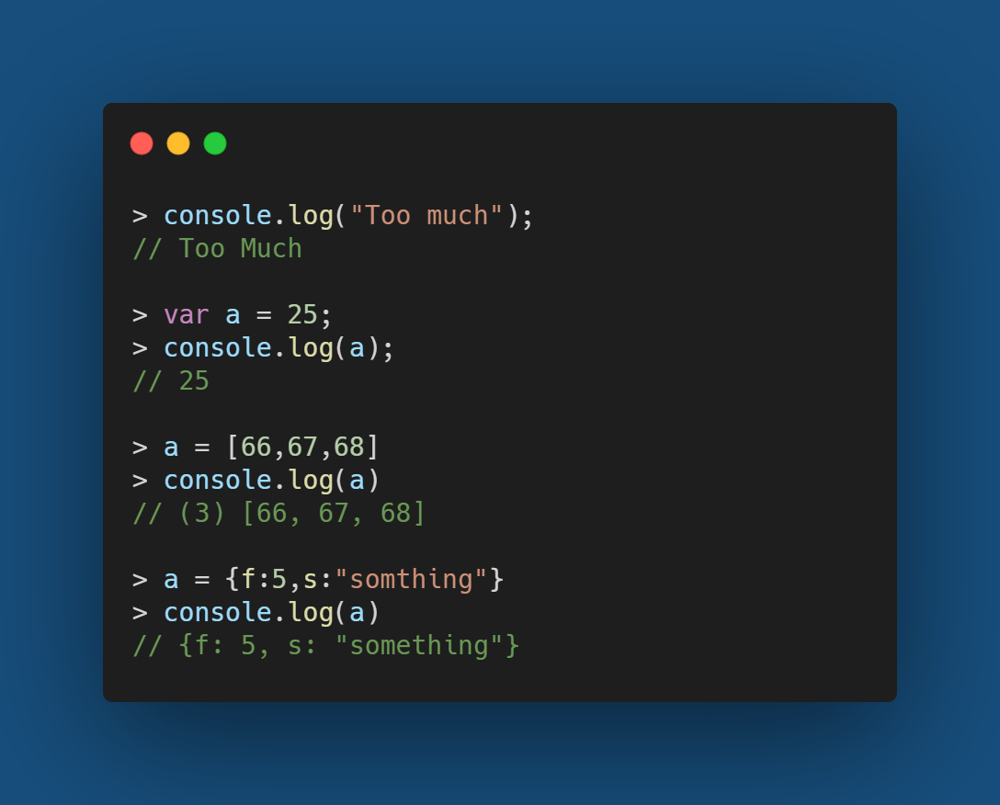
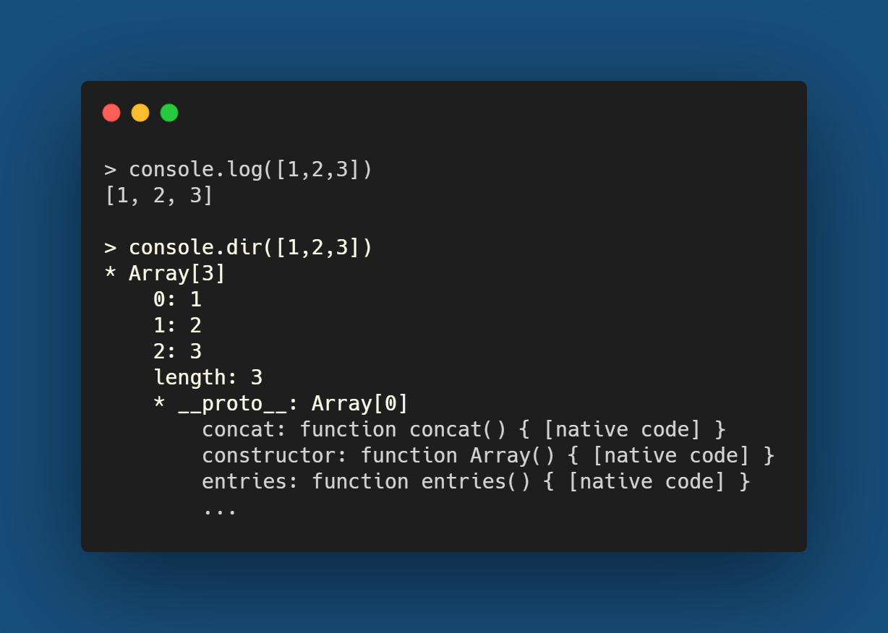
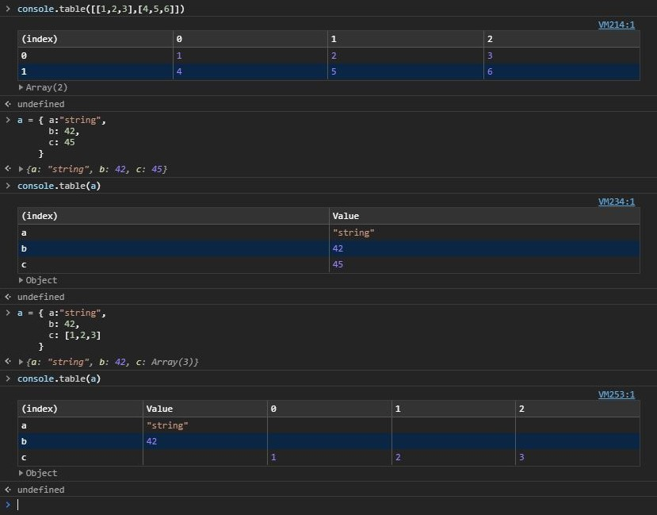
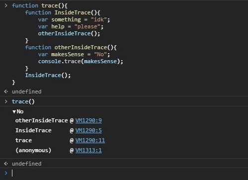
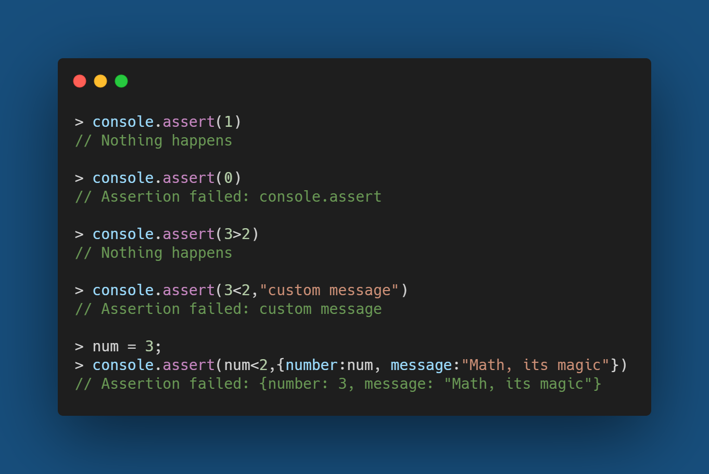

Most of us overuse console.log() for debugging Javascript instead of using a debugging tool, In my case, this is mostly because I learned the art of printing everything to check for errors while brute-forcing my way to learn how to code before someone introduced me to an actual debugging tool. Hence I tend to stick to what I am comfortable with, I think the same applies to a lot of us 😜, doesn't it?  

Nevertheless, I am not here to discuss how many of us hesitate to use debugging tools because neither do I 😝 but there is something we all can do to improve our debugging skills. I was surprised to know that there are more methods in the console object than just log(). Here I will try to go through some of them with some examples and hope you will start using at least one or two of these news ones because some of them can be life changing :)

## Console.log()  
We know this one very well, don't we :p. Our old friend who can print out any message we pass into it.

## Console.dir()
The dir() method can print a list of properties of the javascript object that has been passed into it. At first dir() and log() might seem a lot similar but there is a huge difference between both of them.  

## Console.log() vs Console.dir()
In theoretical words, everything in javascript is represented as an object even a string. So when we console.log something it is first stringified whereas console.dir() prints the object as a JSON with all its properties and methods. 
Here is an example illustrating the difference between them

## Console.table()
The table() method will print everything in a table format (except numbers and strings because they don't need a table 😝). The table also provides a lot of the option of an excel sheet, like sorting data in ascending or descending for any column. It not only supports arrays of any dimension but all sorts of objects and the clear visibility it provides in tabular form can be very helpful when working with large objects/data.

## Console.trace() 
Like any other error trace you must have seen, the trace() method can print out a complete trace to the console. You can pass in any object or even a custom message which will be printed out similar to a console.log() but along with it will be a trace of calls that lead to the execution of that statement.  

This is a good tool say when working on a project where the same function is being used in a lot of places and you want to know which part of your project is making a bad call to that function causing problems and sleepless nights :) The call trace can be very helpful in similar cases and for the internal development process

## Console.assert(assertion,message) 
The assert() method logs out an error if the expression passed inside it evaluates to false but won't log anything if the expression evaluates to true.  

This can be very helpful when working with a big project where you don't want every function to log into the console especially when they run properly, you just want them to log out errors when there is a problem. So assert can be used while checking some condition and on failure, it will start logging out the whole state so the debugging process can be streamlined

