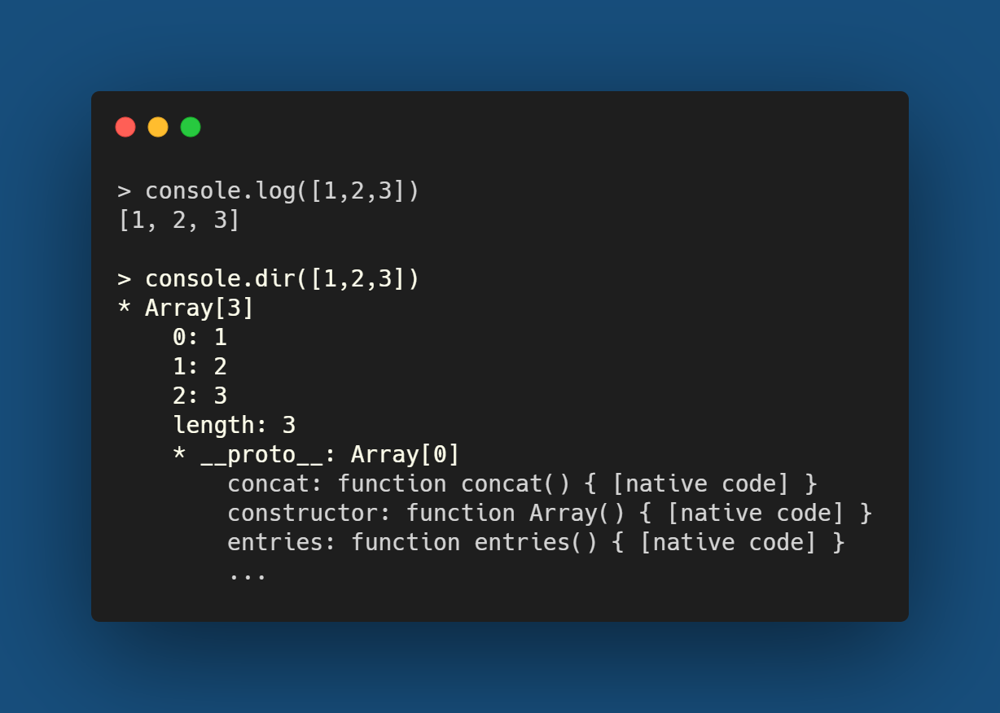
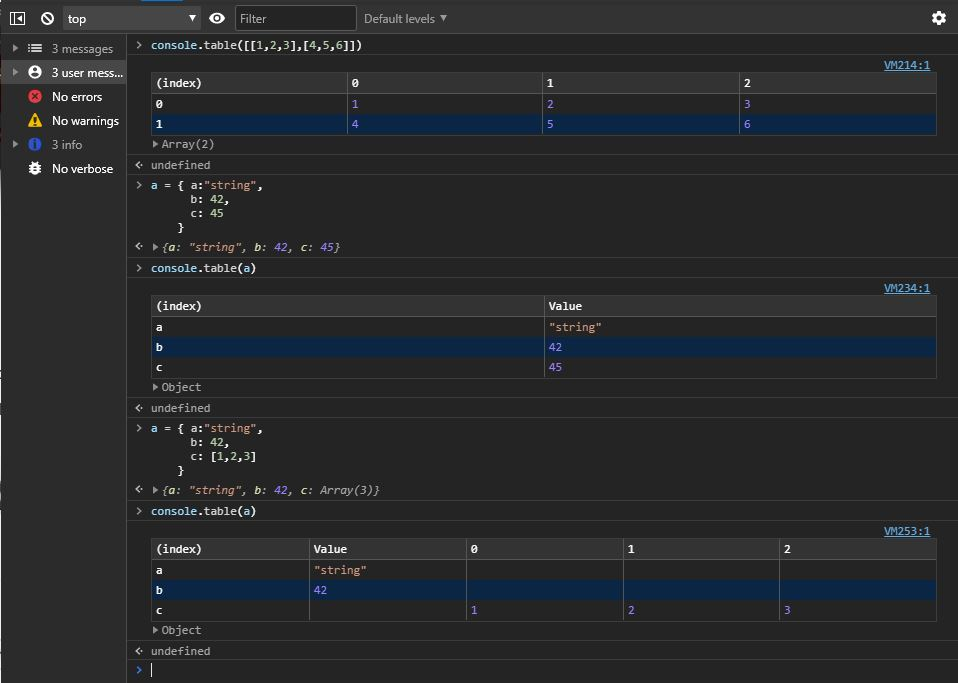
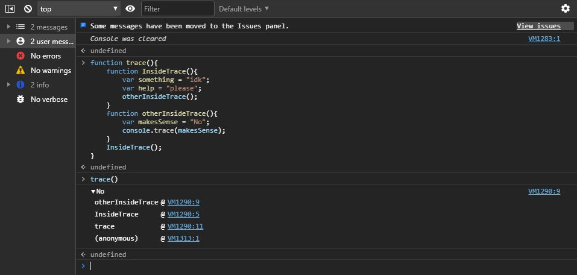
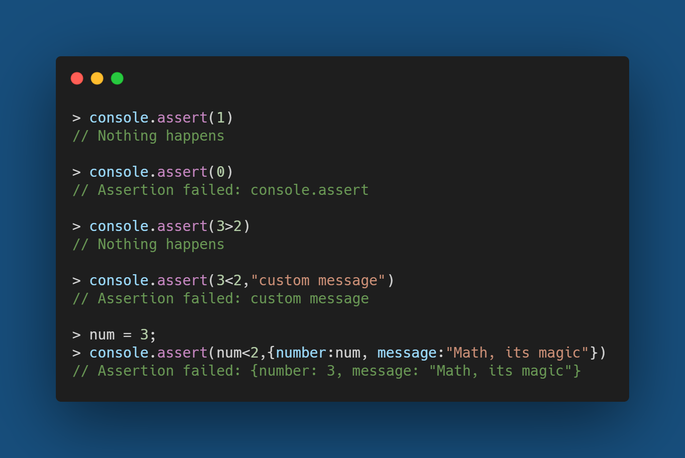

Most of us over use console.log() for debuging our Javascript functions insted of actually using a debugging tool, In my case that's mostly because I learned the way of printing everying to check for errors while brute forcing my way while learning to code way before someone introduced me to a debugging tool. Hence I tend to stick to use what I am comfertable with, I think the same applies for most of us :p, does it?  

Nevertheless I am not here to discuss how many of us hesitate to use debugging tools because neither do :p. But there is something we can do to improve our way of brute forcing with way too many console.logs(). Even to me it came to me as a surprise that there are more methods in console object than just log(). Here I will try to go through some of them with some examples and hope you will start using atleast one or two news ones because some of them can be life changing :)

## Console.log  
We know this one very well, don't we :p. Our old friend who can print out any message we pass into it.

## Console.dir
The dir() method can print a list of properties of the javascript object that has been passed into it. dir() and log() might seem a lot similar but there is a huge difference between both of them.  

## Console.log() vs Console.dir()
In theorical words, everything in javascript is be represented as an object even a string. So when we console.log something it is stringifyed but console.dir prints the object as a JSON with all its properties and methods.  
Here is an example of the difference between both of them   

## Console.table()
Ever wanted to print a big object with lots of properties or simply a multi dimension array? Then Console.table is the most clean and effective way of printing such data which can help a lot in the debugging process.  

## Console.trace() 
The trace() method can print out a complete trace to the console. You can pass in any object or message which will be printed out similar to a console.log() but along with it will be a trace of calls which lead to the execution of that statment.  

This is good when the same function is being used in a lot of places and you want to know which part of your project is making a bad call to that function causing problems and sleepless nights :) 

## Console.assert(assertion,message) 
The assert() method logs out an error if the expression passed inside it evaluates to false but won't log anything if the expression evaluates to true.  

This can be very helpful when working with a big project where you don't want every function to log into the console every time they are run properly, you just want them to log out errors when there is a problem. So assert can be used while checking some condition and on failure it will start logging out the whole state so the debugging process can be streamlined

