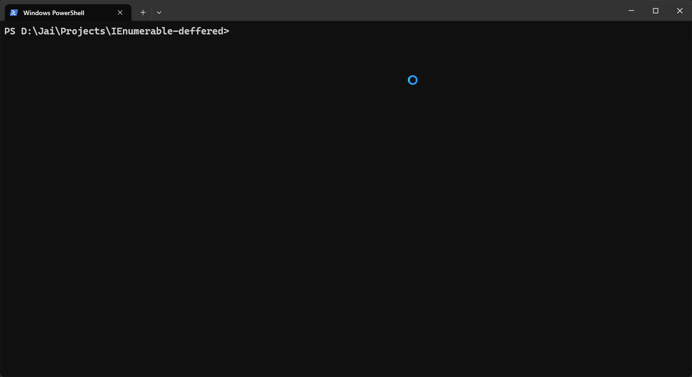

## Backstory

While debugging a piece of C# code, we added a stopwatch to measure the performance of various code sections. For some reason, looping over a set of elements took 50 seconds, whereas all the preprocessing just before looping over it took less than 0.1 seconds. After several hours of debugging (which was quite humbling), we discovered that the dataset was an IEnumerable. The 50 seconds were actually spent on preprocessing, but due to deferred execution, the stopwatch was showing the time taken to register the query rather than its actual execution. To learn why it happened, continue reading

This blog is more for me than for you. Hopefully, five years from now, if I encounter the same issue, Google will recommend my own blog to me ☠️

## What is Deferred Execution?

Deferred execution, also known as lazy evaluation, means that the evaluation of an expression is delayed until its result is actually required. In the context of IEnumerable, this means that when you define a query, it isn't executed immediately. Instead, the query is only executed when you iterate over the results.

## How Deferred Execution Works

When you create a LINQ query or any other IEnumerable sequence, you're essentially creating a blueprint for how to obtain the data, not the data itself. The actual execution of this blueprint is postponed until you start iterating over the sequence.

```csharp
var numbers = new List<int> { 1, 2, 3, 4, 5 };
var evenNumbers = numbers.Where(n => n % 2 == 0);
// At this point, no filtering has actually occurred. In this example, evenNumbers is an IEnumerable that represents the concept of "all even numbers in the list". The Where method hasn't actually been called yet.
```

## Benefits of Deferred Execution

- **Improved Performance:** By delaying execution, you can avoid unnecessary computations. If you only need the first few elements of a large sequence, deferred execution allows you to stop processing once you have what you need.
- **Memory Efficiency:** Since the entire result set doesn't need to be in memory at once, you can work with very large datasets more efficiently.
- **Composition:** You can build complex queries by chaining multiple operations together without incurring the cost of multiple iterations over the data.

## When is the Query Actually Executed?

The query is executed when:

- You iterate over the results using a `foreach` loop
- You call methods like `ToList()`, `ToArray()`, or `ToDictionary()`
- You use operators like `First()`, `Last()`, or `Count()`

## Example of Deferred Execution

```javascript
var numbers = new List<int> { 1, 2, 3, 4, 5 };
var query = numbers.Where(n => n > 2).Select(n => n * 2);
numbers.Add(6); // This will affect the query result
foreach (var num in query)
{
    Console.WriteLine(num); // Output: 6, 8, 10, 12
}
```

In this example, even though we modified the numbers list after defining the query, the new element is included in the result. This is because the query isn't executed until the `foreach` loop.

```csharp
var stopwatch = new Stopwatch();

IList<string> paragraph = new List<string> { "This", "is", "a", "test", "program" };

stopwatch.Start(); // Timer started

var waitingParagraph = paragraph.Select(value =>
{
    Thread.Sleep(500); // Simulate some heavy processing
    return value;
});

Console.WriteLine($"Time taken - {stopwatch.Elapsed}"); // Around 00:00:00.0006335
stopwatch.Restart(); // Reset timer to 0

foreach (var value in waitingParagraph)
{
    Console.Write($"{value} "); // Output: This is a test program
}

Console.WriteLine($"Time taken - {stopwatch.Elapsed}"); // Around 00:00:02.6724506
```

In this example, even though we're using `Thread.Sleep` within the `.Select` projection, the processing isn't executed until we start iterating over all the elements one by one. As a result, the stopwatch shows that looping over the elements takes more than 2 seconds, but this is actually the time spent executing the `.Select` command for each element as it is requested.

A fun use case for this could be creating a typing awareness animation by introducing randomness into the `Thread.Sleep` time to achieve the desired effect.



## Difference Between Deferred Execution in IEnumerable and a List in C#

Understanding the difference between IEnumerable and List in terms of execution is crucial for efficient C# programming. Here's a comparison:

- **Evaluation:** IEnumerable uses deferred execution, while List executes immediately and stores all results in memory.
- **Memory:** IEnumerable is memory efficient as it doesn’t store all elements in memory at once, whereas List does, making it more memory-intensive.
- **Performance:** IEnumerable can be more performant when you don't need all elements at once, while List can be faster when you need repeated access to elements since the data is already in memory.

Here's an example to illustrate the difference:

```csharp
var numbers = new List<int> { 1, 2, 3, 4, 5 };

// IEnumerable (deferred execution)
var evenNumbersQuery = numbers.Where(n => n % 2 == 0);

// List (immediate execution)
var evenNumbersList = numbers.Where(n => n % 2 == 0).ToList();

numbers.Add(6);

Console.WriteLine("IEnumerable results:");
foreach (var num in evenNumbersQuery)
{
    Console.WriteLine(num); // Output: 2, 4, 6
}

Console.WriteLine("List results:");
foreach (var num in evenNumbersList)
{
    Console.WriteLine(num); // Output: 2, 4
}
```

In this example, the IEnumerable query (`evenNumbersQuery`) includes the newly added number 6, while the List (`evenNumbersList`) does not, as it was evaluated before the addition.

Choose between IEnumerable and List based on your specific use case, considering factors like data size, frequency of access, and whether you need a snapshot or the most up-to-date data.

## Conclusion

99% of the time, I would have gotten away without knowing this, but it's for that 1% when not having a clear understanding of the platform or framework you work with can come back to bite you xD. It was a valuable learning experience, for sure!