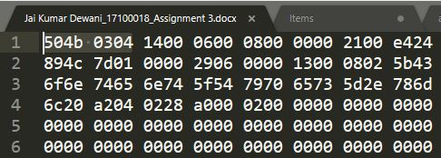
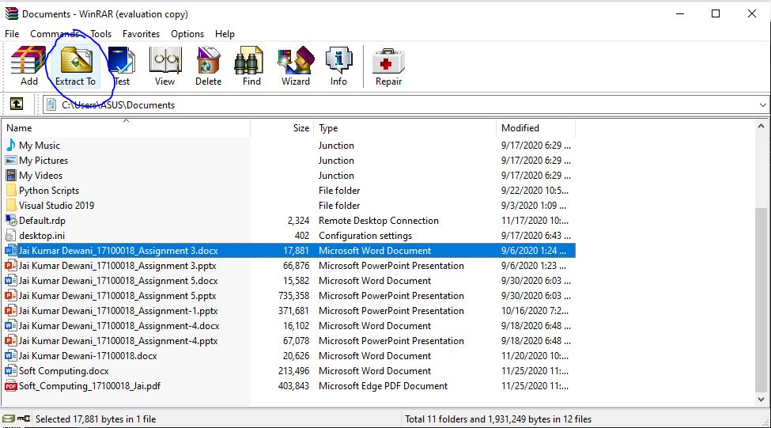
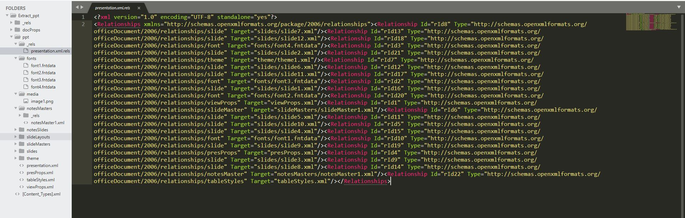

Around 2007, Microsoft switched from their proprietary binary format DOC, PPT, XLS, etc to an open format which stores data as a collection of XML files all zipped together with everything from media to template information to how the text is to be formated. These new formats came with new extensions DOC**X**, PPT**X**, XLS**X**, etc where **X** stands for XML and allows this format to be more open and accessible, allowing this format to be parsed and understood by any other software that wishes to parse it and with this DOCX is the most used and popular standard. The same goes for other Microsoft formats. 

Since all Microsoft formats are ZIP files that contain everything in XML format, all blob elements like Images, Videos and Audio are stored as it is in the `/media` folder. 

Extensions are just a fancy codeword for your operating system to help him understand how to handle a file, to open it in MS Word or MS Powerpoint. The actual file type is determined by the Signature of files (magic number) which is a sequence of bytes present in the header which is unique for each file type [List of file signatures](https://en.wikipedia.org/wiki/List_of_file_signatures).

> **Talk is cheap, Show me the code** - Linus Torvalds  

## See it for yourself

Open your Docx, Pptx, or any MS Office file in a text editor which should display it in hexadecimal format. Look up the first 4 bytes (8 characters) which should be `504b 0304` and lookup the [Signature of Zip files](https://filesignatures.net/index.php?page=search&search=ZIP&mode=EXT). **They both match!** Hence internally both the files are the same, the only difference is caused by the OS assigning different software to open a file depending on the extension at the end of the filename. 

Enough analyzing, let's get inside this mess!

## Let's Hack Microsoft Office files!

Open any Zip Programs like 7-Zip or WinZip and select an MS Office file and choose `Extract to` and select the location where you want to unzip the file. 

### How Media is stored in MS Office files
What makes this new format open is that the images, videos, and anything media are stored as it is in the media folder as visible in the folder structure below. 

What makes this even better is that all the text and meta-information is stored in XML format which can be ready openly and parsed easily after understanding the format of XML which is universal for each MS Office file. **Just copy and paste all the media and your work is done!**

## Extra bits 

There are a lot of files that use the same technique of hiding their data behind a zipped file with extensions to let the OS know how to handle the file in execution like

- aar, apk - Android application archive files, create when App Installer files are generated.
- epub - An ebook file format 
- ipa - It is an iOS application archive file, used to distribute installable apps 
- jar - An archive of Java class files and metadata into one package for easy distribution
- kmz - Used for expressing geographic annotation and visualization within two-dimensional maps and three-dimensional Earth browsers
- maff - Mozilla Archive format, used to store all the contents of a webpage in a ZIP file for ease of management
- odp, ods, odt - Used by office suites like OpenOffice and LibreOffice. Text documents (. odt), as well as spreadsheets (. ods) and also presentations (. odp).

> *Like my content? Consider subscribing to my [Newsletter](https://buttondown.email/jai_dewani). or support me by [tweeting][tweet] about my blog*

[tweet]: https://twitter.com/intent/tweet?text=Checkout%20%22Extracting%20Images,%20Audio,%20Videos%20from%20Microsoft%20Office%20files%22%20by%20%40jai_dewani%20%0A%0Ahttps%3A//blogs.jaid.tech/extracting-data-from-microsoft-office/%0A%0A%23microsoft%20%23office%20%23ZIP%20%23Data%20