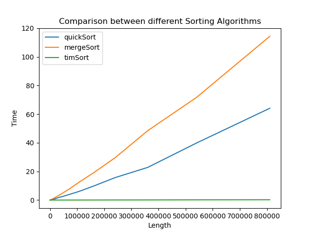
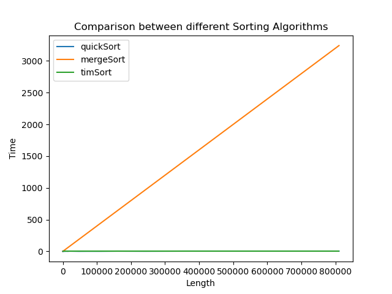

Before starting the blog I wanted to say that this is my first pypi package and it is still in development phase so if anyone finds it intresting, make sure to checkout funmark in [github](https://github.com/jai-dewani/fun-mark)

In this blog I will be using my funmark package to benchmark sorting functions, mainly
- QuickSort
- MergeSort
- TimSort

Lets Start by first importing funmark and random.randint for creating random arrays
```
import funmark
from random import randint
```
Lets create functions for each sorting method 
## QuickSort 
```
def partition(arr,low,high): 
    i = ( low-1 )         # index of smaller element 
    pivot = arr[high]     # pivot 
    for j in range(low , high): 
        if   arr[j] < pivot: 
            i = i+1 
            arr[i],arr[j] = arr[j],arr[i] 
  
    arr[i+1],arr[high] = arr[high],arr[i+1] 
    return ( i+1 ) 

def quickSort(argv): 
    arr = argv[0]
    low = argv[1]
    high = argv[2]
    if low < high: 
        pi = partition(arr,low,high) 
        quickSort([arr, low, pi-1]) 
        quickSort([arr, pi+1, high]) 
```
## MergeSort
```
def mergeList(arr, l, m, r): 
    n1 = m - l + 1
    n2 = r- m 
    L = [0] * (n1) 
    R = [0] * (n2) 
    for i in range(0 , n1): 
        L[i] = arr[l + i] 
    for j in range(0 , n2): 
        R[j] = arr[m + 1 + j] 
    i = 0     
    j = 0 
    k = l     
    while i < n1 and j < n2 : 
        if L[i] <= R[j]: 
            arr[k] = L[i] 
            i += 1
        else: 
            arr[k] = R[j] 
            j += 1
        k += 1
    while i < n1: 
        arr[k] = L[i] 
        i += 1
        k += 1
    while j < n2: 
        arr[k] = R[j] 
        j += 1
        k += 1

def mergeSort(argv):
    arr = argv[0]
    l = argv[1]
    r = argv[2]
    if l < r: 
        m = (l+(r-1))//2 
        mergeSort([arr, l, m]) 
        mergeSort([arr, m+1, r]) 
        mergeList(arr, l, m, r) 
```
## TimSort
```
def timSort(argv):
    ar = argv[0]
    ar.sort()
    return ar
```

## BenchMarking the above functions 

Lets create funmark.Benchmark() objects for each functions 
```
merge = funmark.Benchmark()
quick = funmark.Benchmark()
tim = funmark.Benchmark()
```

Now lets create random arrays of sizes ranging from 
```
listSize = 10
maxSize = 10**6
while listSize < maxSize:
    ar = [randint(1,10**5) for listSize in range(listSize)]
    
    time, memory = merge.run(quickSort, ar, 0, len(ar)-1)
    merge.add(len(ar), time, memory)
    
    time, memory= quick.run(mergeSort, ar, 0, len(ar)-1)
    quick.add(len(ar), time, memory)

    time, memory = tim.run(timSort, ar)
    tim.add(len(ar), time, memory)

    listSize = int(2*listSize)
``` 
For each function I am running .run(function Name, parameter) to get their runtime and memory usage and then I am saving them to their respective objects using .add(size, time, memory)
At the last line of while loop and increasing the size of listSize so that we can get these values for different sizes of list

## Plotting comparision graphs   
```
merge.compareTime("Length", "Time", "Compression between Sorting Algorithms", quick, tim)
```
Here I am plotting the graph of time with *merge* and passing *quick* and *tim* to plot all of them together, here is the result of this line



As you can see QuickSort even though has bigger worst case time complexity that MergeSort, its average case is much better due to 

- Auxiliary Space: Quick sort is an in-place sorting algorithm.  Merge sort on the other hand requires a temporary array to merge the sorted arrays and hence it is not in-place.

- Worst case: The worst case of quicksort O(n^2) can be avoided by using randomized quicksort. It can be easily avoided with high probability by choosing the right pivot.

- Locality of reference: Quicksort in particular exhibits good cache locality and this makes it faster than merge sort in many cases like in virtual memory environment.

- Tail recursion: QuickSort is tail recursive while Merge sort is not. A tail recursive function is a function where recursive call is the last thing executed by the function. The tail recursive functions are considered better than non tail recursive functions as tail-recursion can be optimized by compiler.

And Tim Sort performs exceptionally better than both as expected, hence it's better to use python's in-build .sort() method as long as your need is plain sorting.

```
merge.compareMemory("Length", "Time", "Compression between Sorting Algorithms", quick, tim)
```

Here I am plotting the graph of memory with *merge* and passing *quick* and *tim* to plot all of them together, here is the result of this line



The plot for QuickSort is just below the TimSort plot hence it isn't clearly visible in this plot but from this we can understand that MergeSort requires extra space where as QuickSort and TimSort don't!

This was just a simple analysis of Sorting Algorithms but funmark can be used to do benchmark and analysis for any python code as long as it can be writter in a function.

If you liked what this library can do then check it out on [github](https://github.com/jai-dewani/fun-mark) and drop a star and look into issue tab if you want to contribute!