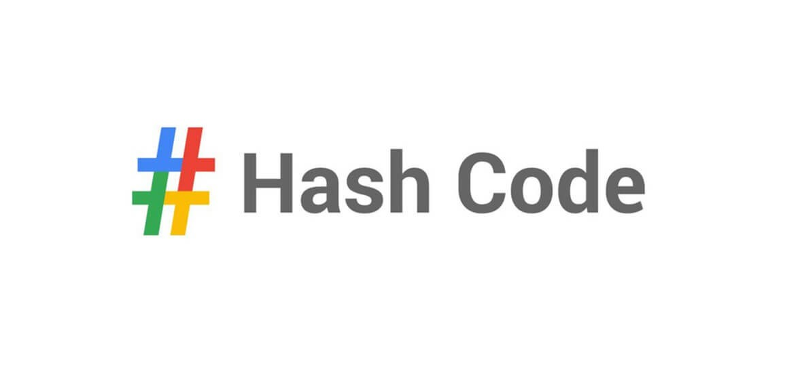
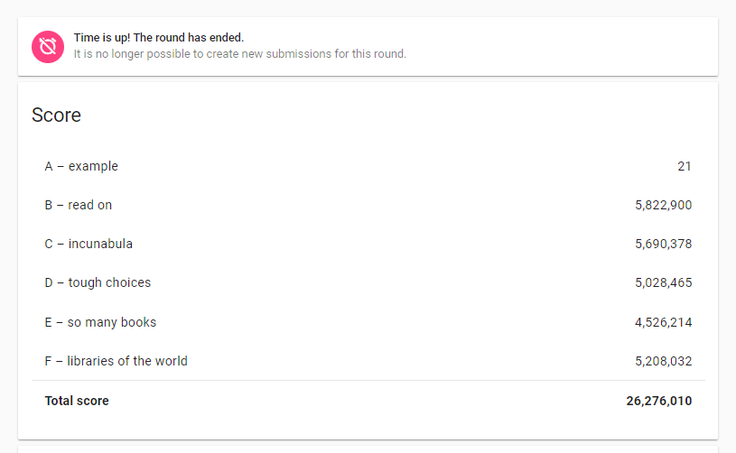

This was my first time participating in google hashcode. Since I didn't even know this competition existed till January 2020. After going through the [official website](https://codingcompetitions.withgoogle.com/hashcode/about) I thought it's is just another Algorithmic Team-based Competitive programming contest but turns out hashcode is one of its type of contest where you get to solve a real-life problem which is faced by engineers at google which at this moment can't be solved exactly so you have to aim for the best possible solution and the more close you get to that perfect solution, the more points you earn during the contest.
 
The contest is of 4 hours with 1 problem and 6 testcases in separate text files which are openly available. You need to write a solution and run it locally on your system (make sure you have a good system, because it will be helpful) with the given testcases given, and submit the outputs in a text file on the basis of which you earn points. Might wanna rent a cheap cloud space for four hours if you don't trust your system.
 
Google provides a sample problem to get some idea of how the problems at hashcode are like so we decided to solve the practice problem a week before the contest to get some idea of how to approach the main contest but ended up postponing it till the evening when the actual contest was supposed to take place, still, we still discovered a lot of things like  
 
- They don't need a perfect solution, just a good approximation will work! Which helped in narrowing down our approach during the actual contest
- Try not to apply DP or some other heavy memory-hungry solution to get a perfect answer. It's about getting the best solution possible (I guess this is what soft computing is!)
- Try to aim a good balance between memory and processing while building a solution so that you are able to get some iterations of output during the 4 hours of the contest
- A cheap hack can be: use hashmaps, heaps, priority queue whenever possible as it will help you search for items faster 
- Don't waste time thinking a lot, Don't wait too long! If you can code it without too much hassle. Do it and see how it affects your score.
- There is no limit on the number of submissions and also they will consider your best score as the final answer for each file independently
- Suppose there are two test cases A and B.
    - In the first submission you get 20 and 2 points for testcase A and B respectively
    - In the second submission you get 3 and 30 points for testcase A and B respectively
    - At last, the total score will be 20 + 30.
    - Use this to create solutions for each testcase independently if nothing else is working. One algorithm might work well for A, Another one might work well with B. 
 
### *Warning: Solution Discussion Ahead*
 
After our first submission where we just chose the first library which had the least signup time, we got somewhat 8 Million points. Then we started considering the Total profit of the library per unit of time wasted on signup which gave us 13M at first and 15M after some minor tweaking and suddenly we realized we were selecting the libraries having the least Profit per unit signup time which was supposed to be maximum because we want the maximum profit in minimum span of time (don't know why this flawed method even brought us to 15M from 8M). Just after updating a single line, we Jumped from 15M to 26M! That too without the D testcase because it was taking too much time to run, adding the output of D testcase gave us a little boost of .25M points which is where we ran out of time.
 

 
So we ended up with our first hashcode with 26.27M points. Already excited to participate next year!

<a rel="nofollow" href="https://www.linkedin.com/pulse/hashcode-2020-experience-jai-kumar-dewani/">
 Link to my orignal article on LinkedIn</a>
