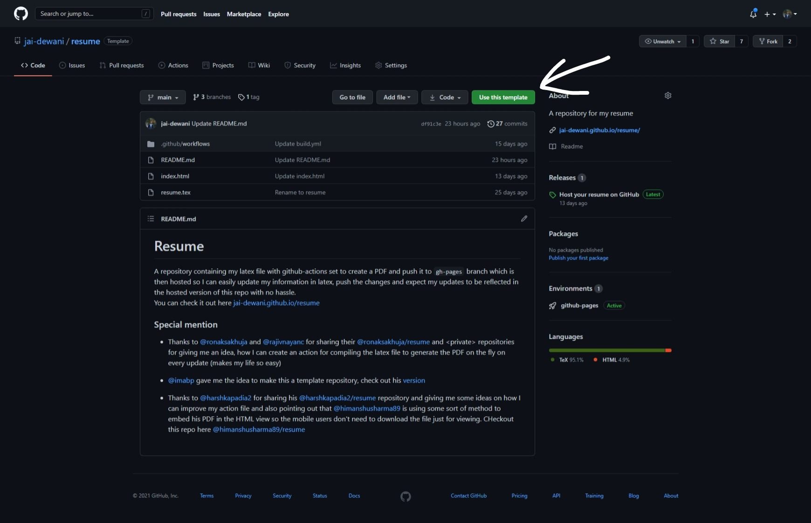

Things I am going to cover: 

→ Hosting your resume hassle-free  
→ How to use your [github.io](http://github.io) domain instead of random google drive links   
→ Update your resume with easy commits without changing the URL 

> You can checkout my [template repository](https://github.com/jai-dewani/resume) and start using it with just one click



## The Problem

It has been a reoccurring problem in my life, where suppose I am filling a form where I have been asked to provide a URL pointing to my **latest** resume (emphasis on the latest, cause most of these forms were to be shared with HRs and recruiters so you want all the latest achievements there), and everyone like I used Google Drive to easily share there resume by creating a sharable link.

But most often than not my slow brain would think of that **one** important thing I missed out on in my resume or say I got selected into a prestigious program just days after filling this forum. Now I need this information to be there on that resume accessible from the same URL, so what should I do? But now I think I have a way to solve this problem using GitHub and GitHub Actions

## The Solution

Before I explain my solution, let me preface that my resume is written in latex which I need to compile to generate my resume in PDF format so I have incorporated that step as well to save my 10 seconds which otherwise I would have wasted on compiling 😂 but you can skip that step if you don't use latex to generate your resume and directly push your pdf instead of latex files into master branch though you might need to remove all the latex compiling steps from the GitHub actions. Don't hesitate to reach out to me on Twitter [@jai_dewani](www.twitter.com/jai_dewani) if you need any help customizing this repository to your need.  

Here is what my solution is: 

- Create a repository named `resume`  
- Commit all the required latex files into the main branch  
- Commit an `index.html` which when hit should redirect you to your resume.
So theoretically you could just share the URL `<github-username>.github.io/resume` and it will redirect the person to `<github-username>.github.io/resume/resume.pdf`. Here is what that HTML looks like 

```html
<!DOCTYPE html>
<html lang="en">
<head>
    <meta charset="UTF-8">
    <meta http-equiv="X-UA-Compatible" content="IE=edge">
    <meta name="viewport" content="width=device-width, initial-scale=1.0">
    <title>Loading, wait....</title>
</head>
<body>
    Loading, wait....
</body>

<script> 
location.href = "https://jai-dewani.github.io/resume/resume.pdf";
</script>
</html>
```


- Create a GitHub workflow that would move this file to the `gh-pages` with the `index.html` file as well cause this is the file responsible for redirecting the user from `<github-username>.github.io/resume` to `<github-username>.github.io/resume/resume.pdf`. After testing various ways to do the same thing, I have settled on this workflow which compiles all the latex, creates a build folder and moves everything necessary to it, and pushed the build folder to `gh-pages` branch
```yml
name: Compile and upload résumé PDF
on:
    push:
        branches:
            - "main"
        paths:
            - "resume.tex"
            - "index.html"
            - ".github/workflows/**"
    pull_request:
        branches:
            - "main"
        paths:
            - "resume.tex"
            - "index.html"
            - ".github/workflows/**"

jobs:
    build_latex:
        runs-on: ubuntu-latest
        container:
            image: danteev/texlive:latest
        steps:
            - name: Checkout
              uses: actions/checkout@v2
              with:
                  persist-credentials: false

            - name: Compile LaTeX document
              uses: xu-cheng/latex-action@v2
              with:
                  root_file: resume.tex

            - name: Post Processing
              run: |
                  mkdir build 
                  cp *.pdf build/ 
                  cp index.html build/
                  
            - name: Git add
              run: git add resume.pdf
              
            - name: Deploy to GitHub Pages
              uses: JamesIves/github-pages-deploy-action@4.1.4
              with:
                  BRANCH: gh-pages
                  FOLDER: build
                  CLEAN: true
```

- Enable GitHub pages for `gh-pages` to host all the files in that branch on your `<github-username>.github.io/resume` URL.

Now when you share the URL to the repo `<github-username>.github.io/resume` and it will redirect the person to your resume `<github-username>.github.io/resume/Resume-<name>.pdf` or you could share the pdf link directly, totally an aesthetic choice. 

Some advantages of this are:

- Since you are using a GitHub repository, it should be easy to override the PDF resume, make a commit, push on main branch and the GitHub action would make all the changes required and push them to the `gh-pages` branch

- The URL that you would share for resume will have your GitHub username as well so it would help create a different identity of you compared to most resume links which are just long-ass Google Drive links. 

I think I now have a permanent solution to this problem which I personally like will use till I find something even better xD

PS: You even connect the main branch of your repo to overleaf after connecting your GitHub to overleaf to update the latex file from overleaf only which provides you an almost live rendered version of your latex and push from there to your repo which would then compile the latex file and push the PDF into `gh-pages` branch. 

Did I just spend 4 hours solving a problem that takes 10 mins manually? Yes. 
and I would do that again if required, every time 😂

> PS: You can check out my resume at [https://jai-dewani.github.io/resume](https://jai-dewani.github.io/resume)

## Update

I am now using iframe to render the pdf on the `<github-username>.github.io/resume` page only, instead of redirecting to the full pdf URL, this was I can skip that ugly redirecting page and the URL looks clean as well. So the new `index.html` looks like 

```html
<!DOCTYPE html>
<html lang="en">
<head>
    <meta charset="UTF-8">
    <meta http-equiv="X-UA-Compatible" content="IE=edge">
    <meta name="viewport" content="width=device-width, initial-scale=1.0">
    <title>Resume - Jai Kumar Dewani</title>
    <style>
        *{
            border:0;
            margin:0;
        }
    </style>
</head>
<body>
    <div style="height: 100vh;">
        <iframe src="https://jai-dewani.github.io/resume/resume.pdf" width="100%" height="100%">
    </div>
</body>
</html>
```

For the people who might be thinking why I haven't used PDF.js yet is because I think people feel comfortable in whatever PDF engine their browser is using cause, they are used to it by now and I don't want to introduce javascript to this solution unless it's really necessary.

Do let me know if there is anything I missed out on that we can do to make this workflow more seamless cause the base idea was mine but a lot of small things that you see here were suggested to me by other people

Credits: 

- Thanks to [@ronaksakhuja](https://github.com/ronaksakhuja) and [@rajivnayanc](https://github.com/rajivnayanc) for sharing their [@ronaksakhuja/resume](https://github.com/ronaksakhuja/resume) and \<private\> repositories for giving me an idea, how I can create an action for compiling the latex file to generate the PDF on the fly on every update (makes my life so easy)
- [@imabp](https://github.com/imabp/) gave me the idea to make this a template repository, check out his [version](https://github.com/imabp/resume)
- Thanks to [@harshkapadia2](https://github.com/harshkapadia2/) for sharing his [@harshkapadia2/resume](https://github.com/harshkapadia2/resume) repository and giving me some ideas on how I can improve my action file and also pointing out that [@himanshusharma89](https://github.com/himanshusharma89/) is using some sort of method to embed his PDF in the HTML view so the mobile users don't need to download the file just for viewing. CHeckout this repo here [@himanshusharma89/resume](https://github.com/himanshusharma89/resume/)
