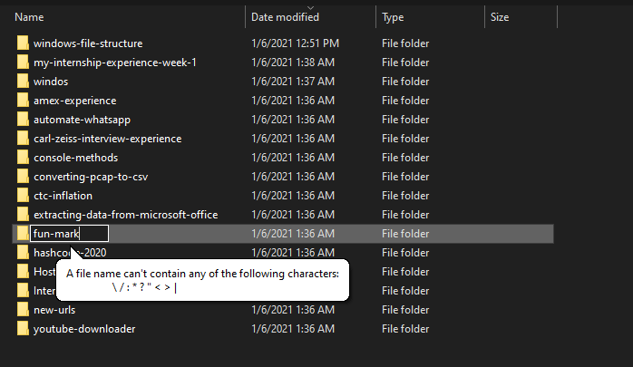
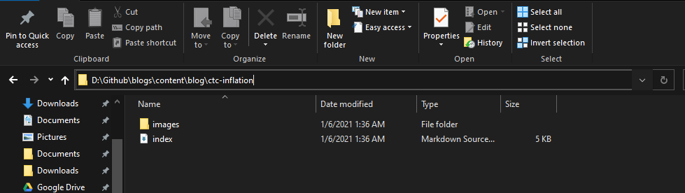

> If like the 76.65% per of people you also use windows then you must have encountered an error like this while trying to rename your file/folder to be more precise by adding punctuations



Some of us tend to ignore the error and use some other character and it works....unless the other character also can't be used, now it has become frustrating. Let's get to the bottom of why windows does not allows us "Free Humans" to choose whichever name we want for our folders. After all, it's not like I am trying to put anything special. : and ? are very common characters in use. Why can't I name my file `Why did I do this?` and my folder `Childhood Images: Don't open` or my Marvel movies folder `Marvel > DC` 😤

## Let's find out

Well, most of these restrictions are due to how windows file manager handles filename including other features around them. Hence, these characters are reserved for special purposes, actions, or denote a certain meaning. For example 

### Let's use a backward slash`\`

Can't. They are used to access contents inside a certain folder, so windows might confuse my folder `to\you` as a folder `you` inside a folder `to` which is obviously wrong. 


### Can I use a colon `:` then?

You wish. They are used to denote a drive letter which is usually at the beginning of a file path to tell windows which drive to look into for specific content. Hence having the ability to name a folder `E:` can cause problems though technically solving this challenge isn't hard but maybe windows skipped this to avoid confusion in the mind of users who aren't very technical but still depend on a computer for critical tasks.


### If not backward slash `\` then maybe forward slash `/` can be used?

Naah, Windows allows users to have shortcuts that can point to a website that might have a forward slash `/`. For example:  `https://twitter.com/jai_dewani`. 

### Okay so maybe a question mark `?` or an asterisk`*`

Nope. If allowed it can cause problems because `?` can be used as a wildcard while searching in file explorer. Consider this example where I am searching for all folders that have `power` in their name 


The same goes with `*`. 


### I love "using" quotes 

Sorry for your loss, but quotes are used to refer to file paths that have space in them for example a game inside your Program files will be referred to as `"C:\Program Files\Epic Games\rocketleague"` due to folders having space in between them. If quotes aren't used the system can be get confused if the statement is a 3 part command or a single complete path, if there is no space then double quotes aren't needed.   
I can't say this for sure but windows wanted to keep the system deterministic in a way that the system shouldn't have to make guesses as to what the user wants it to do, knocking out the possibility to guess if this input is a path to a specific file or a wildcard search.

### What about less-than `<` and Greater than `>`

Well they are also used to redirect output to some other file like the command below can redirect the output of `cat a.py` to the file `b.py` 
```
cat a.py > b.py
```
or the same can be run without space in-between
```
cat a.py>b.py  
```
and having > in files names can cause confusion for windows as to if the user means to redirect the output or this character part of the file name?     

### And a lot more 
for which I couldn't find proper reasons to justify why they aren't allowed to be used, maybe [tweet](https://twitter.com/intent/tweet?text=%40jai_dewaani) at me if you know any ones I missed that can be included. 

## But isn't Windows smart enough? 
I mean Linux and Mac OS allow users to use special characters in file/folder names that might have some other meaning or command attached to them, so why can't windows do the same? In the end, it comes down to Windows creating a secure environment for their users because having file names as `*`, `-rf` or `~` can cause huge accidents deliberately or my mistake from the user. 

*Fun Fact:* Most of these characters were assigned their special meaning back from MS-DOS and are continued to be supported to date in windows. 

### References 

- https://gs.statcounter.com/os-market-share/desktop/worldwide  
- https://www.quora.com/Why-are-special-characters-not-allowed-in-file-names