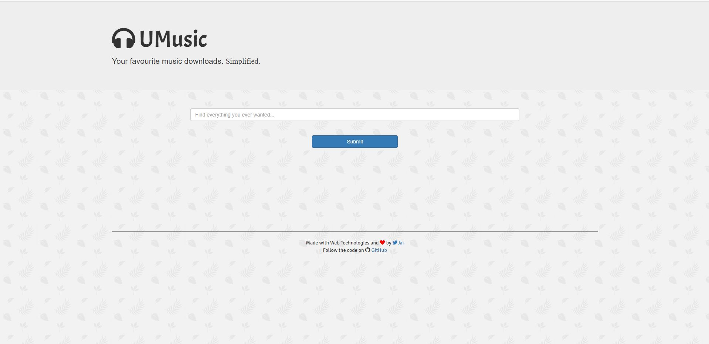
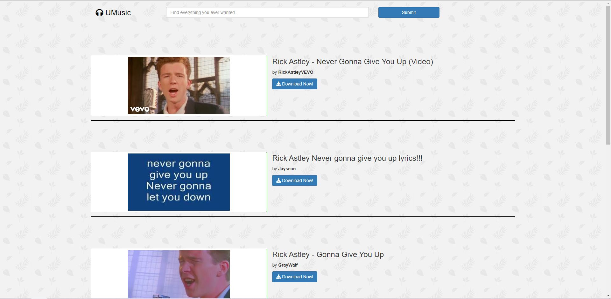

<!-- 

> Photo by [Tim Gouw](https://unsplash.com/@punttim?utm_source=unsplash&amp;utm_medium=referral&amp;utm_content=creditCopyText) on [Unsplash](https://unsplash.com/s/photos/frustrated?utm_source=unsplash&amp;utm_medium=referral&amp;utm_content=creditCopyText) -->

*Note: This blog is for educational purpose*  

Install [Node](https://nodejs.org/en/), I'll recommend installing the recommended version. Npm comes with node which will be helpful in installing packages which we will need while building this project. 

## Initialize a node project

`npm init`  
Will initialize a node project. You will be promted to fill out some fields which will be reflected in the `package.json`, you can enter the information or press enter to skip as you can always change these fields manually in `package.json`. The output should look something like this (package name depending on your folder name)

```
This utility will walk you through creating a package.json file.
It only covers the most common items, and tries to guess sensible defaults.

See `npm help init` for definitive documentation on these fields
and exactly what they do.

Use `npm install <pkg>` afterwards to install a package and
save it as a dependency in the package.json file.

Press ^C at any time to quit.
package name: (trial)
version: (1.0.0)
description: A test project
entry point: (index.js)
test command:
git repository:
keywords:
author:
license: (ISC)
About to write to C:\Users\ASUS\Desktop\trial\package.json:

{
  "name": "trial",
  "version": "1.0.0",
  "description": "A test project",
  "main": "index.js",
  "scripts": {
	"test": "echo \"Error: no test specified\" && exit 1"
  },
  "author": "",
  "license": "ISC"
}
```

## Installing all the required libraries 

Create a new folder and open your terminal in this new folder, and start installing these libraries one by one:

### body-parser
`npm install body-parser`

### dotenv
`npm install dotenv`

### ejs
`npm install ejs`

### express
`npm install express`

### request
`npm install request`

### youtube-dl
`npm intall youtube-dl`

### Or you can install all of them in one command
`npm install body-parser dotenv ejs express request youtube-dl`  
*Pretty neat, huuh?*

## Creating a Youtube Data API v3 Key and setting up .env

- Go to [Google APIs](https://console.developers.google.com/apis/library/youtube.googleapis.com) and Enable Youtube Data API v3 for a project to use it for searching 
- You should see a `Manage` button after enabling the API, click on it and create a `Credential` which we will save in a .env fine 
- Create a `.env` file which is used to all the credentials and things you shouldn't have on your codebase. The directry should look something like this: 
```bash
.
├── .env
└── package.json
```
- Store your API Credentials in `.env` something like this  
```
APICREDENTIAL=your-key-here
```

## Creating index.js and home page to search for youtube videos

Create an index.js after which your directry should look something like 
```bash
.
├── index.js
├── .env
└── package.json
```

### Importing all the libraries needed 
```node
var express = require("express");
var app = express();
var request = require("request");
var bodyParser = require("body-parser");
var fs = require("fs");
var youtube = require("youtube-dl");
var dotenv = require("dotenv");
```

### Setting up project 
Here we are setting view-engine, body-parser, public folder, .env cretentials and current directry location (this last one will be used later)
```node
app.set("view engine", "ejs");
app.use(bodyParser.urlencoded({extended: true}));
app.use(express.static("public"));
dotenv.config();
var cwd = __dirname;
```

### Creating root and search routes
```node
app.get("/", function(req, res) {
	res.render("home");
});
```

### Listing to any request on localhost:8080
Make sure this section of code in always at the bottom most part of your, its not neccessary but a standard pratice because 
```node
var port = 8080;
app.listen(port, function(req, res) {
	console.log("The Server is up!\nGo to your favourite Web Browser and visit localhost:" + String(port) + " to see the Application");
});
```

But before you can server our index page we need to actually need to create it

## Creating views and public folder to store our VIEWS/EJS and CSS files

Create new files to match the following folder structure
```bash
.
├── index.js               
├── .env                 
├── package.json             
├── public                   
|   ├── leaves-pattern.png           
│   └── styles.css              
└── views                               
	├── partials               
	│   ├── header.ejs         
	│   └── footer.ejs    
	├── search.ejs             
	├── started.ejs             
	└── home.ejs  
```

You can download the leaves-pattern.png from [here.](https://github.com/jai-dewani/umusic/raw/upstream/public/leaves-pattern.png) 

### Style.css
Since I am no expert in css have so I can only provice the code, though its very simple and short
```
input {
	width: 100%;
	padding: 1%;
}

.container {
	width: 70%;
}

#submitButton {
	width: 20%;
	margin: auto;
}

#search{
	padding-top: 20px;
	padding-bottom: 3%;
}

#brand, a:hover{
	margin: 0 !important;
	padding-top: 25px !important;
	text-decoration: none !important;
	color: black !important;
}

#footnote {
	text-align: center;
	margin-top: 10%;
	margin-bottom: 3%;
	font-family: "Signika", "sans-serif";
}

.fa-heart {
	color: red;
}

.dataField {
	margin-top: 5%;
	border-bottom: 2px solid black;
}

.col-md-5 {
	border: 1px solid white;
	border-right: 2px solid green;
	margin-top: 1%;
	margin-bottom: 1%;
	text-align: center;
}

#download {
	color: white;
}

hr {
	border-top: 1px solid black;
}

h1 {
	font-family: "Acme", "sans-serif";
}

span {
	font-family: "Sedgwick Ave", "cursive";
}

body {
	background: url(/leaves-pattern.png);
}

#startedPage {
	text-align: center;
}
```

### views/partials/header.ejs
Contains basic header of html with links to various css files that are needed
```
<!DOCTYPE html>
<html>
	<head>
		<title>UMusic - Your Music Simplified</title>
		<link rel="stylesheet" href="https://maxcdn.bootstrapcdn.com/bootstrap/3.3.7/css/bootstrap.min.css" 
		integrity="sha384-BVYiiSIFeK1dGmJRAkycuHAHRg32OmUcww7on3RYdg4Va+PmSTsz/K68vbdEjh4u" 
		crossorigin="anonymous">
		<link rel="stylesheet" href="https://use.fontawesome.com/releases/v5.5.0/css/all.css" 
		integrity="sha384-B4dIYHKNBt8Bc12p+WXckhzcICo0wtJAoU8YZTY5qE0Id1GSseTk6S+L3BlXeVIU" 
		crossorigin="anonymous">
		<link href="https://fonts.googleapis.com/css?family=Acme|Signika|Sedgwick-Ave" rel="stylesheet">
		<link rel="stylesheet" href="/styles.css">
	</head>

	<body>
```

### views/partials/footer.ejs
The footer section, links to JS files with closing body and html tags
```
	<div class="container" id="footnote">
		<hr>
		Made with Web Technologies and <i class="fas fa-heart"></i> by <a href="https://twitter.com/jai_dewani"><i class="fab fa-twitter"></i>Jai</a>
		<br>
		Follow the code on <i class="fab fa-github"></i> <a href="http://www.github.com/utkarsh-raj/umusic">GitHub</a>
	</div>
		
		<script
		src="https://code.jquery.com/jquery-3.3.1.min.js"
		integrity="sha256-FgpCb/KJQlLNfOu91ta32o/NMZxltwRo8QtmkMRdAu8="
		crossorigin="anonymous"></script>
		<script src="https://maxcdn.bootstrapcdn.com/bootstrap/3.3.7/js/bootstrap.min.js" 
		integrity="sha384-Tc5IQib027qvyjSMfHjOMaLkfuWVxZxUPnCJA7l2mCWNIpG9mGCD8wGNIcPD7Txa" 
		crossorigin="anonymous"></script>
		<script src="script.js"></script>
	</body>
</html>
```

Don't forget to change the my name with yours and the link to my twitter account :P

### views/home.ejs
A simple search bar to search your favourite youtube video you want to download 
```
<%- include ('./partials/header') %>

<div class="jumbotron">
	<div class="container">
		<h1><i class="fas fa-headphones"></i> UMusic</h1>
		<p>Your favourite music downloads. <span>Simplified.</span></p>
	</div>
</div>

<div class="container" id="main">
	<form action="/search" method="POST" class="form-group">
		<div class="container" id="search">
			<input type="text" name="query" placeholder="Find everything you ever wanted..." class="form-control">
		</div>
		<div class="container" id="submitButton">
			<input type="submit" name="Let's Go!" class="btn btn-primary form-control">
		</div>
	</form>
</div>
<%- include ('./partials/footer') %>

```


## Lets try running our project and see how it looks 

Running a node.js project in very simple, just run the following commands on the terminal at the root of your project-folder
```
node index.js
```
Now go to your browser and open `localhost:8080` and hopefully you'll see something like 



Make sure that you close the server by pressing `Ctrl + C` and restart it to any changes you make on `index.js`

## Creating a Search Route

### index.js
```node
app.post("/search", function(req, res) {
	var query = req.body.query;
	var finalQuery = "";
    var i = 0;
    for (i = 0; i < query.length; i++) {
        if (query[i] !== " ") {
            finalQuery += query[i];
        }
        else {
            finalQuery += "+";
        }
    }
	const url = "https://www.googleapis.com/youtube/v3/search?part=snippet&q=" + finalQuery + "&key=" + process.env.APICREDENTIAL;
	request(url, function(error, response, body) {
		if (error) {
			console.log(error);
		}
		var data = JSON.parse(body);
		console.log(data);
		res.render("search", {data: data});
    });
});
```

### views/search.ejs
A search page which will show the top 5 videos from your search result, you can increase the number of videos by changing the limit of the limit of i on `<% for (i = 0; i <= 4; i++) { %>`.
```
<% include ./partials/header %>

<div class="container">
    <div class="row">
        <div class="col-md-2">
            <a href="/">
                <h3 id="brand"><i class="fas fa-headphones"></i> UMusic</h3>
            </a>
        </div>
        <form action="/search" method="POST" class="form-group">
            <div class="col-md-6" id="search">
                <input type="text" name="query" placeholder="Find everything you ever wanted..." class="form-control">
            </div>
            <div class="col-md-2" id=search>
                <input type="submit" name="Let's Go!" class="btn btn-primary form-control">                
            </div>
        </form>
    </div>

        <% var i = 0;%>
        <% for (i = 0; i <= 4; i++) { %>
            <% if (data.items[i].id.kind === "youtube#video") { %>
                <div class="row dataField">
                    <div class="col-md-5 img-thumbnail img-responsive">
                        ">
                    </div>
                    <div class="col-md-7">
                        <h3><%= data.items[i].snippet.title %></h3>
                        <p>
                            by <strong><%= data.items[i].snippet.channelTitle; %></strong>
                        </p>
                        <a id="download" href="/download/<%= data.items[i].id.videoId %>">
                            <button class="btn btn-primary"><i class="fas fa-download"></i> Download Now!</button>
                        </a>
                    </div>
                </div>
                <br>
            <% } %>
        <% } %>
</div>

<% include ./partials/footer %>
```

## Search page done, Lets check if it works or not 

Run your project and go to `localhost:8080` and try searching something. Hope fully you'll see something like 



*Like my search results? :p*

## Now, creating a route to download a youtube video. Exicted? 

### creating a GET route to `/download/<video-url>`

```node
app.get("/download/:videoUrl", function(req, res) {
    var video = youtube("http://www.youtube.com/watch?v=" + req.params.videoUrl, 
    ["--format=18"],
    {cwd: cwd});

    video.on("info", function(info) {
        console.log("Download Started");
        if (info.track === null) {
            track = String(info.title + ".mp4");
        }
        else {
            track = String(info.track + ".mp4");
        }
        video.pipe(fs.createWriteStream(track));
        res.redirect("/started");
    });;
});

app.get("/started", function(req, res) {
    res.render("started");
});
```

Youtube-dl allows us to create an object which has many functions to be attached to Event names emitted by the object. We here are using the `video.on('info')` which is executed when the video object receives an `info` signal from youtube.
Inside which we are saving `track` and starting a download using `video.pipe(fs.createWriteStream(track));` while using node's standard file system `fs` library. Since the video is going to be a stream of data which is why we have used `fs.createWriteStream(track)` with the `track` as the file name. 

The extra route is to be redirected after you click the download button to a "Downloaded Succesfully" page. But now we have to create this page. 

## views/started.ejs
```ejs
<%- include ('./partials/header') %>

<div class="container" id="startedPage">
    <h2>Your download has started!</h2>
    <br>
    <p>
        In the meanwhile, you can go back for more downloads <a href="/">here</a>, or feel free to connect with the Dev on <a href="http://www.github.com/utkarshraj/umusic"><i class="fab fa-github"></i> GitHub</a> for bug reports, feedback, or a cup of coffee!
        <br>
        The App is in the Beta Version, so you may find some really neat bugs in here :-)
    </p>
    <div class="container">
        <a href="/"><h4>Get More Videos!</h4></a>
    </div>
</div>

<%- include ('./partials/footer') %>
```

## Done! Lets try downloading some videos

Run your Node server, try searching something and click on download.  
### *Notice something weird?*  
The file is download in your project folder and not in your download location! You might have guessed it, but if not this is because of `cwd`, we assigned `var cwd = __dirname` while setting up the project which basically takes the current location of the file which is index.js inside of your project-folder. That is all good, maybe I'll pass set my download folder in `cwd` which will solve my problem. 

But there is another problem, after clicking the download button I don't get prompt in my browser about a file downloading. Can you guess why is that? 

Well that's because you aren't sending the file to the user, its just being downloading in the backend which luckly is your system so you can access this download, but this won't work when you want to host this solution and let users download youtube videos in their system. 

## PATCH
### index.js 
This is require just about 10 lines of changes in your `download/<video-url>` route 
```node
app.get("/download/:videoUrl", function(req, res) {
    var video = youtube("http://www.youtube.com/watch?v=" + req.params.videoUrl, 
    ["--format=18"],
    {cwd: cwd});
    var size, filename;

    video.on("info", function(info) {
        if (info.track === null) {
            track = String(info.title + ".mp4");
        }
        else {
            track = String(info.track + ".mp4");
        }
        size = info.size
        filename = info._filename
        res.writeHead(200, {
            "Content-Disposition": "attachment;filename=" + filename,
            'Content-Type': 'video/mp4',
            'Content-Length': size
        });
    });;

    video.on('data',(data)=>{
        res.write(data)
    })

    video.on('end',(end)=>{
        res.end();
    })
});
```

The major changes are that in `video.on('info',)` we are just writing the head of our response with the file-type, name and its length. And we have added `video.on('data')` which is where we are taking the stream of data from youtube and sending to the user via `res` while closing the connection when the `video.on('end')` prompt is received to our `video` object

## Finally Done! I promise its done 

Don't trust me? Turn on your server and start downloading, make sure to remember the Youtbe Data API is free up to a limit so it won't be profitable to turning to host this for everyone unless the access is restricted to a group of people. 

## Done? Naah, there are so much more that can be one 

- [ ] Allow for a vider option of quality to chose while downloading a video
- [ ] Add feature to download whole playlists in a single click

Think you can solve one of these problems? Feel free to contribute to this project [utkarsh-raj/umusic](https://github.com/utkarsh-raj/umusic) which has been used as a refence to write this blog.  